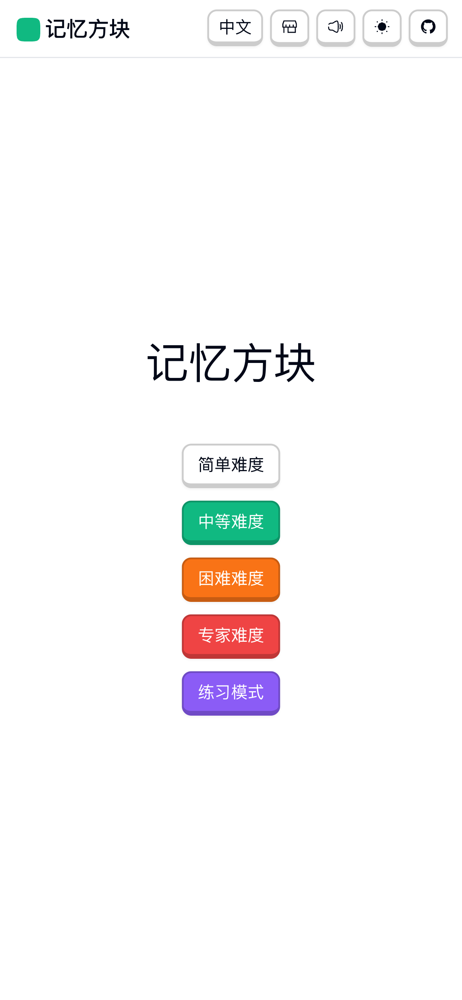
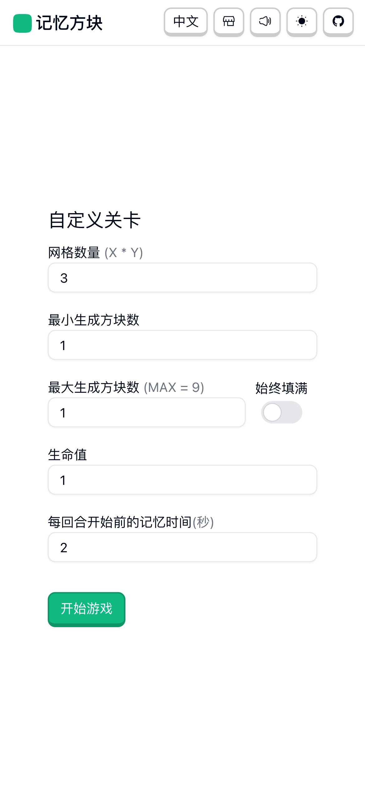
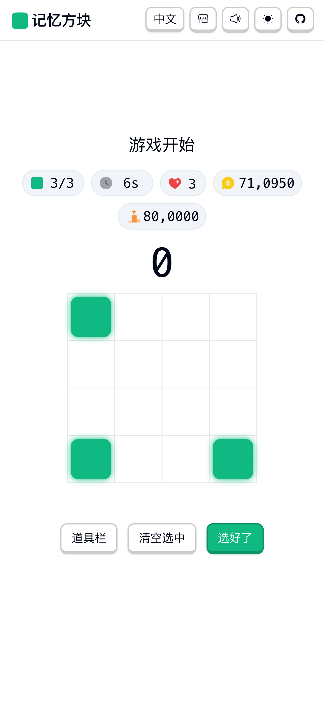
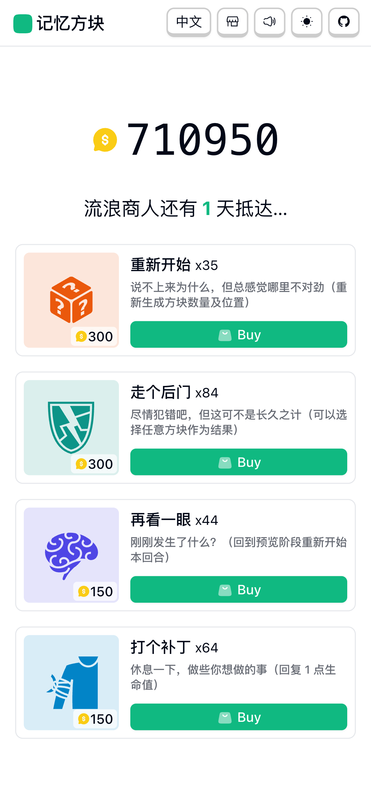
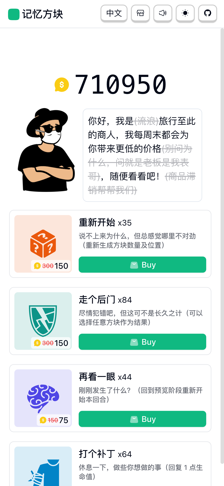

  

  <h3>Memory Block（记忆方块）</h3>

---

## 截图

  
  
  
  
  

## 在线游玩
你现在就可以立马玩到这款有趣的 [Memory Block](https://libondev.github.io/memory-block/) 小游戏

## 游戏规则
- 选择游戏难度
- 根据游戏难度的不同, 在每关开始前会有不同的记忆时间
- 记忆时间结束后, 在网格中点击高亮过的方块
- 点选完成后如果方块正确, 得分增加, 并重新生成方块
- 得分初始倍率为 10, 每隔 5 秒倍率减 1, 直到倍率为 1, 不同难度还会有额外得分倍率加成

## 功能
- [x] 基本流程
- [x] 难度选择
- [x] 计分系统
- [x] 计时系统
- [x] 数量展示
- [x] 容错机制
- [x] 练习模式
- [x] 历史最高分
- [x] 表盘自适应
- [ ] 游玩热力图
- [x] 本地缓存
- [ ] 彩色方块
- [x] 游戏音效
- [x] 游戏界面增加键盘操作
- [x] i18n
- [x] 积分系统
- [x] 道具兑换
- [x] 道具系统
- [x] 道具商人

### 后续功能
一些想做但不确定会不会做的功能
- [ ] 排行榜
- [ ] 联机模式

## 补充
- 图标来自于：[iconify](https://iconify.design/)，同时使用了 [icones](https://icones.js.org/) 网站来预览图
- 有趣的游戏音效来自：[Duolingo](https://www.duolingo.com/)，因为我也是个Duolingo软件的忠实用户，很喜欢TA的音效设计。PS：请原谅我未经允许的使用😜
- 项目技术栈为：Vue3 + Vite5 + TypeScript + TailwindCSS + VueRouter + VueUse

<!--
Scale
https://2.flexiple.com/scale/home

Vektors
https://www.vektors.pro/

Pixeltrue
https://www.pixeltrue.com/free-illustrations

getillustrations
https://www.getillustrations.com/illustration-packs

oblikstudio免费插画包
https://gumroad.com/oblikstudioWeareSkribbl
https://weareskribbl.com/

Aracreator
https://www.aracreator.com/

Niceillustrations
https://niceillustrations.com/free-illustrations/

Open Peeps
https://www.openpeeps.com/

VectorCreator
https://icons8.com/vector-creator

Fresh Folk
https://fresh-folk.com/

Iconscout
https://iconscout.com/free-illustrations

Draw Kit
https://www.drawkit.io/

Humaaans
https://www.humaaans.com

Gallery.manypixels
https://gallery.manypixels.co/

Mixkit Art
https://mixkit.co/art/

Isoflat
https://isoflat.com/

IRA Design
https://iradesign.io/

Undraw
https://undraw.co/illustrations

Lukaszadam
https://lukaszadam.com/illustrations

-->
